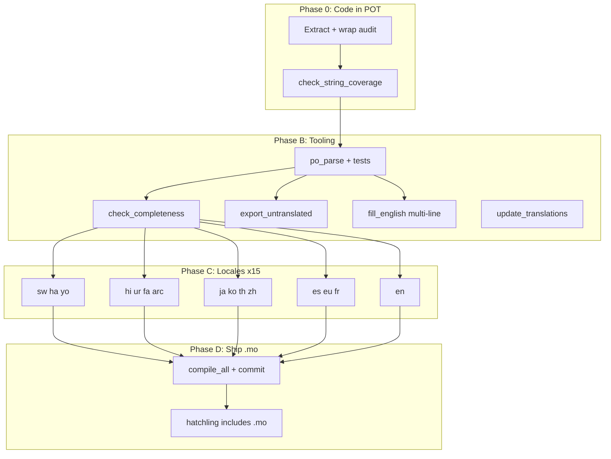

# 100% Internationalization Plan — All User-Facing Strings, All Supported Locales

**Goal:** Achieve **100% translation coverage** for every **user-facing** string in the application (CLI + textual interface) for **every supported locale**, with **verifiable** tooling, **shippable** `.mo` artifacts, and **documented** workflows.

**Out of scope:** Documentation site translation (MkDocs / `docs/<lang>/`), except where noted for **strict build parity** on Read the Docs (warnings policy only).

**Related:** Build/runtime implications (gettext, `.mo`, hatchling) should be read alongside this plan; see project docs and `ccbt/i18n/scripts/README.md`.

---

## 1. Definitions

### 1.1 “User-facing string”

A string that can appear to an end user in:

- CLI output (`console.print`, `click.echo`, `ClickException`, progress text, table headers).
- TUI (Textual widgets, bindings labels, notifications, dialogs).
- Any error or status message shown in the above contexts.

**Excluded (unless product decides otherwise):** Internal `logger.debug` / `logger.info` messages never shown in UI; protocol identifiers; raw tracebacks.

### 1.2 “100% for a locale”

For a given `ccbt/i18n/locales/<lang>/LC_MESSAGES/ccbt.po`:

| Locale | Rule |
|--------|------|
| **en** | Every canonical `msgid` has `msgstr` filled (typically `msgstr` identical to `msgid` after `fill_english`), so completeness tools and editors show a full catalog. |
| **All other supported locales** | For every `msgid` in the canonical template (`.pot`), `msgstr` is **non-empty** and **not** a blind copy of English where a real translation is required (product may allow keeping technical tokens unchanged). Fuzzy markers (`#, fuzzy`) should be **cleared** after review. |

### 1.3 Canonical template

- **Path:** `ccbt/i18n/locales/en/LC_MESSAGES/ccbt.pot` (regenerate from code; see §3).
- **Source of truth for “all strings”:** The set of non-empty `msgid` entries in that `.pot` after a full extract (and after any code audit to wrap missing `_()` calls).

### 1.4 Supported application locales (15)

**en, es, eu, fr, ja, ko, th, zh, hi, ur, fa, arc, sw, ha, yo**

**Note:** A **de** (German) `.po` may exist on disk; treat as **optional** unless product adds `de` to supported lists (`language` command, `LANGUAGE_MAP`, docs). This plan does not require `de` unless explicitly adopted.

---

## 2. Status log (update after each milestone)

*Use ISO dates. After shared parser lands, re-run `check_completeness` and record counts here.*

| Date | Milestone | POT msgids (non-empty) | Notes |
|------|-----------|-------------------------|-------|
| *(fill in)* | Baseline | *(run extract + count)* | e.g. `uv run python -m ccbt.i18n.extract ccbt ccbt/i18n/locales/en/LC_MESSAGES/ccbt.pot` then count |
| *(fill in)* | Tooling B complete | — | Parser + completeness + export |
| *(fill in)* | Per-locale 100% | — | List each lang |

**Update cadence:** After (1) tooling merge, (2) each language batch to 100%, (3) `.mo` commit, (4) CI/manual i18n workflow green.

---

## 3. Phase 0 — Code coverage: every user string reaches the POT

**Outcome:** No “invisible” English left outside gettext.

| # | Activity | Files / action |
|---|----------|----------------|
| 0.1 | Run extract | `uv run python -m ccbt.i18n.extract ccbt ccbt/i18n/locales/en/LC_MESSAGES/ccbt.pot` (or project-standard extract module). |
| 0.2 | Implement or verify `check_string_coverage` | `ccbt/i18n/scripts/check_string_coverage.py` — compare extracted `_()` / `_n` / `_p` from `ccbt/` to `.pot`; `--fail-on-gap` for CI/pre-commit. **If missing, implement as part of Phase B.** |
| 0.3 | Audit CLI | `ccbt/cli/**/*.py`: `help=` → `lambda: _("...")` where needed; literals in `console.print` / `ClickException` → `_()`. |
| 0.4 | Audit TUI | `ccbt/interface/**/*.py`: same for user-visible strings. |
| 0.5 | Audit daemon IPC client surfaces | User-visible errors from `ccbt/daemon/ipc_client.py` (and similar): ensure translation at CLI/TUI or translatable message keys. |
| 0.6 | Re-run extract | Regenerate `.pot`; msgmerge into all `.po` (`update_translations` when available). |

**Acceptance:** `check_string_coverage --fail-on-gap` passes; `.pot` msgid count stable and documented in §2.

---

## 4. Phase B — Shared gettext parsing and verification tooling

**Outcome:** One correct parser for `.pot` / `.po` (multi-line `msgid` / `msgstr`, continuations, escapes); all tools agree on counts and untranslated sets.

### B1 Shared parser module

| Task | Detail |
|------|--------|
| **New file** | e.g. `ccbt/i18n/po_parse.py` |
| **API** | `iter_po_entries(path) ->` entries with full `msgid` / `msgstr` text; `parse_pot_msgids(path) -> set[str]` (or reuse/merge logic from any existing `_extract_msgids_from_pot` in repo). |
| **Tests** | `tests/unit/i18n/test_po_parse.py`: single-line, multi-line, escaped quotes, empty msgstr, header skipped. |

### B2 `check_completeness.py` rewrite

| Task | Detail |
|------|--------|
| **File** | `ccbt/i18n/scripts/check_completeness.py` |
| **Change** | Remove brittle single-line regex; use shared parser. |
| **Options** | `--lang XX`, `--output-untranslated <dir>` (write per-locale missing list UTF-8). |
| **Windows** | Safe stdout (UTF-8 reconfigure or escape non-ASCII in samples) to avoid `UnicodeEncodeError`. |
| **English rule** | Define whether empty `msgstr` or `msgstr == msgid` counts as “complete” for `en` (recommend: filled `msgstr` via `fill_english`). |

### B3 `export_untranslated.py`

| Task | Detail |
|------|--------|
| **New file** | `ccbt/i18n/scripts/export_untranslated.py` |
| **CLI** | `--pot`, `--locales-dir`, `--out-dir` |
| **Output** | e.g. `msgids_canonical.txt`, `untranslated_<lang>.txt` for translator handoff. |

### B4 `fill_english.py` (multi-line safe)

| Task | Detail |
|------|--------|
| **Canonical** | `ccbt/i18n/fill_english.py` — replace regex-only logic with parser-based fill (`msgstr` := `msgid` for `en` where appropriate). |
| **Duplicate** | `ccbt/i18n/scripts/fill_english.py` — **fix path** (must point to `ccbt/i18n/locales/...`) or **delete** and document single entrypoint. |

### B5 `update_translations.py` (if not already present)

| Task | Detail |
|------|--------|
| **File** | `ccbt/i18n/scripts/update_translations.py` |
| **Behavior** | `msgmerge -U` each `ccbt.po` with `ccbt.pot` (or `polib` fallback); preserve existing translations. |
| **Integration** | `translation_workflow.py` step 2 must succeed. |

### B6 Optional CI gate

| Task | Detail |
|------|--------|
| **When** | Only after all locales hit 100% or policy allows staged thresholds. |
| **Where** | e.g. `.github/workflows/ci.yml` i18n job — fail if `check_completeness` reports &lt; 100% for any supported locale. |

**Acceptance:** Unit tests for parser green; `check_completeness` matches manual `msgattrib`/`msgfmt` sanity on a sample; `export_untranslated` produces correct lists.

---

## 5. Phase C — Per-locale translation to 100%

**Global rules for every locale:**

- Preserve **Rich** markup (`[green]`, `[/green]`, …).
- Preserve **named placeholders** (`{name}`, `{count}`).
- UTF-8; **RTL** (ur, fa, arc): smoke-test CLI and TUI with `CCBT_LOCALE` / `CCBT_UI_LOCALE`.

### C1 — English (`en`)

| Step | Action |
|------|--------|
| 1 | Run parser-based `fill_english.py` after POT is final. |
| 2 | `validate_po` |
| 3 | `check_completeness --lang en` → 100% |

### C2 — Spanish, Basque, French (`es`, `eu`, `fr`)

| File | `ccbt/i18n/scripts/generate_translations.py` |
|------|---------------------------------------------|
| **Dictionaries** | `SPANISH_TRANSLATIONS`, `BASQUE_TRANSLATIONS`, `FRENCH_TRANSLATIONS` |
| **Work** | For every `msgid` in `.pot` not in dict, add translation; run generator; merge; repeat until completeness 100%. |

### C3 — Japanese, Korean, Thai, Chinese (`ja`, `ko`, `th`, `zh`)

| File | `ccbt/i18n/scripts/comprehensive_translations.py` |
|------|--------------------------------------------------|
| **Dictionaries** | `JA_TRANSLATIONS`, `KO_TRANSLATIONS`, `TH_TRANSLATIONS`, `ZH_TRANSLATIONS` (and any `get_translation` helpers) |
| **Note** | Stale docstrings in file (e.g. “278 strings”) — ignore; scale is POT-sized (~1000+). |
| **zh** | Document policy: **Simplified** vs **Traditional** Chinese for project. |

### C4 — Hindi, Urdu, Persian, Aramaic (`hi`, `ur`, `fa`, `arc`)

| File | `ccbt/i18n/scripts/generate_hi_ur_fa_arc_translations.py` |
|------|-----------------------------------------------------------|
| **Work** | Extend per-locale mappings until no production `msgid` falls through to English echo. |

### C5 — Swahili, Hausa, Yorùbá (`sw`, `ha`, `yo`)

| Files | `ccbt/i18n/scripts/generate_african_translations.py`; optionally merge from `add_rich_markup_translations.py` |
|------|-------------------------------------------------------------------------------------------------------------|
| **Work** | Ensure all Rich-heavy strings are covered; complete dicts to 100% against POT. |

**Suggested PR batching:** (1) en + tooling, (2) es+eu+fr, (3) ja+ko+th+zh, (4) hi+ur+fa+arc, (5) sw+ha+yo.

**Acceptance (per locale):** `check_completeness --lang <code>` reports 100%; `msgfmt -c` / `validate_po` passes for that `.po`.

---

## 6. Phase D — Build, packaging, and shipping `.mo`

**Outcome:** Installed wheels/sdists load translations without a post-install `msgfmt`.

| # | Task | Detail |
|---|------|--------|
| D.1 | `compile_all` | `uv run python -m ccbt.i18n.scripts.compile_all` on CI or maintainer machine; requires `msgfmt` in PATH. |
| D.2 | Commit `.mo` | Add `ccbt/i18n/locales/*/LC_MESSAGES/ccbt.mo` to version control **or** enforce generation in release CI before upload to PyPI. |
| D.3 | Hatchling | **Do not rely on** `[tool.setuptools.package-data]` (ignored by hatchling). Ensure `ccbt/i18n/locales/**/*.mo` are included in wheel (default package inclusion or `[tool.hatch.build.targets.wheel] artifacts = [...]`). |
| D.4 | `_is_valid_locale` (optional hardening) | Consider requiring `ccbt.mo` exists, not only `ccbt.po`, so “available” locales match loadable catalogs. |

**Acceptance:** Fresh `pip install` from wheel shows translated CLI/TUI strings for non-`en` locale without manual compile.

---

## 7. Phase E — Documentation strict parity (Read the Docs)

**Outcome:** RTD build matches CI strict documentation policy (optional but listed in sibling plan).

| Activity | Location | Task |
|----------|----------|------|
| E1 | `.readthedocs.yaml` | Set `MKDOCS_STRICT=true` or pass `--strict` to `dev/build_docs_patched_clean.py` |
| E2 | Local | `MKDOCS_STRICT=true uv run python dev/build_docs_patched_clean.py` — fix any new failures |
| E3 | `dev/mkdocs.yml` | Document whether `strict: false` is intentional (“strict via CLI only”) vs aligning YAML |
| E4 | `.github/workflows/build-documentation.yml` | Keep RTD and GHA commands in sync (comment or shared script) |

*This phase does not translate docs; it only prevents doc build drift.*

---

## 8. Phase F — TUI runtime behavior (post-100% `.po`)

**Outcome:** Changing language in the UI updates visible text where feasible.

| Issue | Mitigation |
|-------|------------|
| Strings frozen in `compose()` | Widgets that show static translated labels should handle `LanguageChanged` and re-call `_()` + update widgets, or document “restart / change tab” for full refresh. |
| `TranslationManager.reload()` | Ensure `set_locale` clears gettext cache so new `_()` calls use the new catalog (verify in `ccbt/i18n` / `manager.py`). |

*100% `.po` does not by itself fix dynamic refresh; track as follow-up if product requires live switch without remount.*

---

## 9. Phase G — Final verification and release checklist

1. `uv run python -m ccbt.i18n.scripts.validate_po` — all locales  
2. `uv run python -m ccbt.i18n.scripts.check_completeness` — **100%** each supported locale  
3. `uv run python -m ccbt.i18n.scripts.check_string_coverage --source-dir ccbt --fail-on-gap` — passes  
4. `uv run python -m ccbt.i18n.scripts.compile_all`  
5. Commit **`.po` + `.mo`**  
6. Run manual i18n workflow (e.g. `.github/workflows/i18n-manual.yml` if present) on `main`  
7. Smoke: `CCBT_LOCALE=ja btbt language --list`, `bitonic` language selector, RTL spot-check  

---

## 10. Dependency overview

**Recommended order:** **P0 → B (parser first) → C (parallel batches) → D → G**; **E** in parallel once someone owns doc infra; **F** as needed for UX polish.

---

## 11. Execution checklist (copy for tracking)

- [ ] **P0** Extract POT; implement/verify `check_string_coverage`; audit CLI/TUI/daemon surfaces; POT complete  
- [ ] **B1** `ccbt/i18n/po_parse.py` + `tests/unit/i18n/test_po_parse.py`  
- [ ] **B2** Rewrite `check_completeness.py` + `--output-untranslated` + Windows-safe output  
- [ ] **B3** `export_untranslated.py`  
- [ ] **B4** Multi-line `fill_english.py`; fix/remove broken `scripts/fill_english.py`  
- [ ] **B5** `update_translations.py` + workflow step 2  
- [ ] **C1** `en` 100%  
- [ ] **C2** `es`, `eu`, `fr` 100%  
- [ ] **C3** `ja`, `ko`, `th`, `zh` 100%  
- [ ] **C4** `hi`, `ur`, `fa`, `arc` 100%  
- [ ] **C5** `sw`, `ha`, `yo` 100%  
- [ ] **D** `compile_all`, commit `.mo`, verify hatchling wheel contents  
- [ ] **E** RTD strict parity (optional)  
- [ ] **F** TUI live language refresh (as needed)  
- [ ] **G** Final validation + manual workflow + update §2 status table  
- [ ] **B6** (Optional) CI fail on incomplete translations  

---

## 12. File index

| Path | Role |
|------|------|
| `ccbt/i18n/locales/en/LC_MESSAGES/ccbt.pot` | Canonical template (generated) |
| `ccbt/i18n/locales/<lang>/LC_MESSAGES/ccbt.po` | Per-locale catalogs |
| `ccbt/i18n/locales/<lang>/LC_MESSAGES/ccbt.mo` | Runtime (generated, should ship) |
| `ccbt/i18n/po_parse.py` | **New** — shared parser |
| `ccbt/i18n/scripts/check_completeness.py` | Completeness (rewrite) |
| `ccbt/i18n/scripts/export_untranslated.py` | **New** — translator exports |
| `ccbt/i18n/scripts/check_string_coverage.py` | Implement/verify — code vs POT |
| `ccbt/i18n/scripts/update_translations.py` | msgmerge wrapper |
| `ccbt/i18n/fill_english.py` | English fill (multi-line) |
| `ccbt/i18n/scripts/generate_translations.py` | es, eu, fr |
| `ccbt/i18n/scripts/comprehensive_translations.py` | ja, ko, th, zh |
| `ccbt/i18n/scripts/generate_hi_ur_fa_arc_translations.py` | hi, ur, fa, arc |
| `ccbt/i18n/scripts/generate_african_translations.py` | sw, ha, yo |
| `ccbt/i18n/scripts/add_rich_markup_translations.py` | Rich strings helper |
| `ccbt/i18n/scripts/compile_all.py` | Produce `.mo` |
| `pyproject.toml` | Hatchling; ensure `.mo` packaged |

---

## 13. Notes

- Percentages from old assessments are **stale** until **B2** lands; refresh §2 after first accurate run.  
- **German (`de`)** on disk is optional unless added to supported locale lists.  
- Reaching **100% in `.po`** is independent of **MkDocs** content; this plan focuses on **application gettext** only.  
- The Cursor plan file `.cursor/plans/100%_i18n_translation_plan_*.plan.md` may duplicate **Phase E** details; keep this doc as the **canonical** implementation plan under `docs/en/implementation-plans/`.

---

*End of plan.*
